# Prompt Chatbot → Enhanced Search 완전 워크플로우 (Mermaid 플로우차트)

## 1. 전체 시스템 아키텍처 (상세)

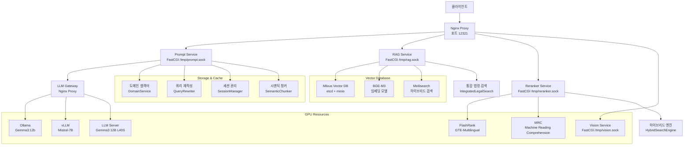

## 2. Prompt Chatbot 완전 워크플로우 (6단계 체인)

```mermaid
flowchart TD
    A[클라이언트 요청<br/>POST /prompt/chatbot] --> B[요청 파싱 및 검증]
    
    B --> C{세션 ID 존재?}
    C -->|Yes| D[기존 세션 파일 로드<br/>SessionManager.load_session]
    C -->|No| E[새 세션 생성<br/>SessionManager.create_session]
    
    D --> F[사용자 메시지 추가<br/>SessionManager.add_user_message]
    E --> F
    
    F --> G[토큰 수 계산<br/>tiktoken 사용]
    G --> H{토큰 제한 초과?<br/>max_total_tokens: 10000}
    
    H -->|Yes| I[LRU 방식으로 오래된 메시지 제거<br/>SessionManager.trim_history]
    H -->|No| J[Query Rewrite 수행<br/>QueryRewriter.rewrite_query]
    I --> J
    
    J --> K[vLLM 호출<br/>Mistral-7B 모델]
    K --> L[대화 기록 분석<br/>최근 3턴 추출]
    L --> M[쿼리 재작성 프롬프트 생성]
    M --> N[재작성 결과 파싱]
    N --> O{신뢰도 > 0.7?}
    
    O -->|Yes| P[재작성된 쿼리 사용<br/>rewritten_query]
    O -->|No| Q[원본 쿼리 사용<br/>original_query]
    
    P --> R[도메인 셀렉터 실행<br/>DomainService.process_query]
    Q --> R
    
    R --> S{사용자 지정 도메인?<br/>domains 파라미터}
    S -->|Yes| T[사용자 도메인 사용 ]
    S -->|No| U{도메인 셀렉터 결과?<br/>domain_candidates}
    
    U -->|Yes| V[자동 선택 도메인<br/>]
    U -->|No| W[전체 도메인 검색<br/>빈 도메인 리스트]
    
    T --> X[Enhanced Search API 호출<br/>POST /prompt/enhanced_search]
    V --> X
    W --> X
    
    X --> Y[RAG 검색 단계<br/>_perform_enhanced_search]
    Y --> Z[하이브리드 재랭킹<br/>FlashRank + MRC + 원본점수]
    Z --> AA[결과 후처리<br/>메타데이터 통합]
    AA --> BB[컨텍스트 구성<br/>format_context]
    BB --> CC{검색 결과 있음?}
    
    CC -->|Yes| DD[시스템 프롬프트 로드<br/>rag_chat_with_docs.txt]
    CC -->|No| EE[시스템 프롬프트 로드<br/>rag_chat_no_docs.txt]
    
    DD --> FF[최종 프롬프트 생성<br/>build_prompt]
    EE --> FF
    
    FF --> GG{시멘틱 청킹 사용?}
    GG -->|Yes| HH[시멘틱 청킹 적용<br/>build_prompt_context_with_semantic_chunking]
    GG -->|No| II[기본 프롬프트 구성<br/>build_prompt_context]
    
    HH --> JJ[LLM 응답 생성<br/>LLM Gateway API 호출]
    II --> JJ
    
    JJ --> KK{LLM_PROVIDER 설정}
    KK -->|vllm| LL[vLLM 서버 호출<br/>Gemma3 12B]
    KK -->|ollama| MM[Ollama 호출<br/>Gemma3:12b]
    
    LL --> NN{스트리밍 모드?}
    MM --> NN
    
    NN -->|Yes| OO[스트리밍 응답 생성<br/>실시간 토큰 전송]
    NN -->|No| PP[전체 응답 생성<br/>일반 HTTP 응답]
    
    OO --> QQ[토큰 누적<br/>accumulated_response]
    QQ --> RR{응답 완료?<br/>done: true}
    RR -->|No| OO
    RR -->|Yes| SS[응답 파싱<br/>parse_structured_response]
    
    PP --> SS
    
    SS --> TT[인용 패턴 추출<br/> 정규식]
    TT --> UU[참고문헌 생성<br/>references 배열]
    UU --> VV[구조화된 응답 구성<br/>JSON 형식]
    VV --> WW[세션에 봇 응답 저장<br/>SessionManager.add_bot_message]
    WW --> XX[세션 파일 저장<br/>SessionManager.save_session]
    XX --> YY[최종 응답 반환<br/>JSON/SSE]
```

## 3. Enhanced Search 완전 플로우 (RAG + Reranker)

```mermaid
flowchart TD
    A[Enhanced Search API<br/>POST /prompt/enhanced_search] --> B[파라미터 검증<br/>query, top_m, top_n, threshold]
    
    B --> C[검색 파라미터 구성<br/>search_params]
    C --> D[도메인 필터 적용<br/>domains, domain]
    D --> E[추가 필터 적용<br/>author, start_date, end_date, title, info_filter, tags_filter]
    
    E --> F[RAG 검색 요청<br/>POST /rag/search]
    F --> G[BGE-M3 임베딩 생성<br/>emb_model.encode]
    G --> H[임베딩 배치 처리<br/>50개씩]
    H --> I[Milvus 벡터 검색<br/>Collection.search]
    I --> J[멀티스레드 검색<br/>10개 스레드]
    J --> K{검색 결과 있음?}
    
    K -->|No| L[빈 결과 반환<br/>empty array]
    K -->|Yes| M[검색 결과 전처리<br/>전처리 및 정규화]
    
    M --> N[재랭킹 데이터 준비<br/>rerank_passages 배열]
    N --> O[원본 결과 매핑<br/>original_results_by_id]
    O --> P[하이브리드 재랭킹 시작<br/>POST /reranker/rerank]
    
    P --> Q{FlashRank 초기화됨?<br/>flashrank_model}
    Q -->|No| R[FlashRank 모델 로드<br/>GTE-Multilingual]
    Q -->|Yes| S[FlashRank 점수 계산<br/>flashrank_score]
    R --> S
    
    S --> T{MRC 모델 초기화됨?<br/>mrc_model}
    T -->|No| U[MRC 모델 로드<br/>MRC 모델]
    T -->|Yes| V[MRC 질문-답변 생성<br/>mrc_answer]
    U --> V
    
    V --> W[MRC 신뢰도 점수 계산<br/>mrc_score]
    W --> X[캐릭터 위치 정보 추출<br/>mrc_char_ids]
    X --> Y[하이브리드 점수 계산<br/>가중 평균]
    
    Y --> Z[가중 평균 적용<br/>FlashRank×0.5 + MRC×0.3 + 원본×0.2]
    Z --> AA[점수 정규화<br/>0-1 범위로 정규화]
    AA --> BB[임계치 필터링<br/>score < threshold 제외]
    BB --> CC[상위 N개 결과 선택<br/>top_n]
    CC --> DD[메타데이터 통합<br/>title, author, date, link]
    DD --> EE[중복 제거<br/>doc_id 기반]
    EE --> FF[순위 정렬<br/>hybrid_score 기준]
    FF --> GG[응답 포맷팅<br/>JSON 구조화]
    GG --> HH[성능 메트릭 수집<br/>처리 시간, 결과 수]
    HH --> II[최종 결과 반환<br/>enhanced_search_response]
```

## 4. 하이브리드 재랭킹 상세 플로우

```mermaid
flowchart TD
    A[재랭킹 요청<br/>POST /reranker/rerank] --> B[요청 데이터 파싱<br/>query, results, total]
    
    B --> C[재랭킹 파라미터 추출<br/>top_k, weight_flashrank, weight_mrc, weight_original]
    C --> D[결과 데이터 전처리<br/>passage_id, doc_id, text, score]
    
    D --> E{FlashRank 모델 로드됨?<br/>self.flashrank_model}
    E -->|No| F[FlashRank 모델 초기화<br/>gte-multilingual-reranker-base]
    E -->|Yes| G[FlashRank 점수 계산<br/>쿼리-문서 관련도]
    F --> G
    
    G --> H[FlashRank 배치 처리<br/>GPU 가속]
    H --> I[FlashRank 점수 정규화<br/>0-1 범위]
    I --> J{MRC 모델 로드됨?<br/>self.mrc_model}
    
    J -->|No| K[MRC 모델 초기화<br/>MRC 모델 로드]
    J -->|Yes| L[MRC 질문-답변 생성<br/>질문에 대한 직접 답변]
    K --> L
    
    L --> M[MRC 배치 처리<br/>GPU 병렬 처리]
    M --> N[MRC 신뢰도 점수 계산<br/>답변 품질 평가]
    N --> O[캐릭터 위치 정보 추출<br/>답변 위치 인덱스]
    O --> P[원본 점수 유지<br/>original_score]
    
    P --> Q[하이브리드 점수 계산<br/>가중 평균 공식]
    Q --> R[점수 정규화<br/>최종 점수 0-1]
    R --> S[임계치 필터링<br/>score < threshold 제외]
    S --> T[상위 결과 선택<br/>top_k개]
    T --> U[결과 정렬<br/>hybrid_score 기준 내림차순]
    U --> V[메타데이터 추가<br/>rerank_position, reranked: true]
    V --> W[응답 구성<br/>reranker_response]
    W --> X[로깅 및 모니터링<br/>처리 시간, 결과 수]
    X --> Y[최종 재랭킹 결과 반환]
```

## 5. Query Rewrite 상세 플로우

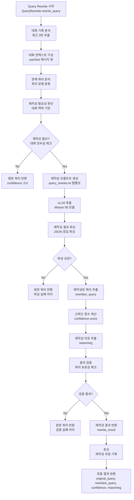

## 6. 도메인 셀렉터 상세 플로우

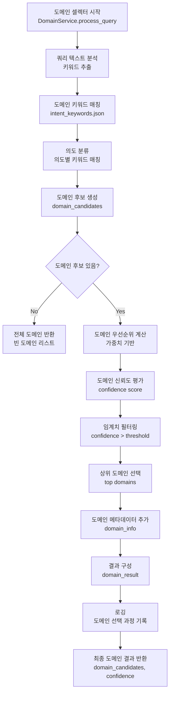

## 7. 세션 관리 상세 플로우

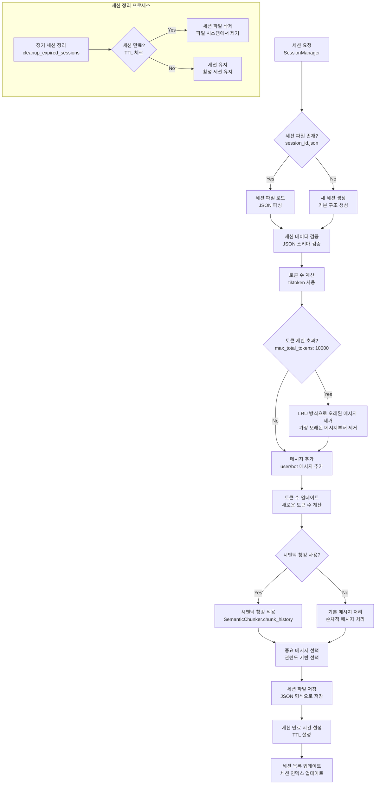

## 8. LLM 응답 생성 상세 플로우

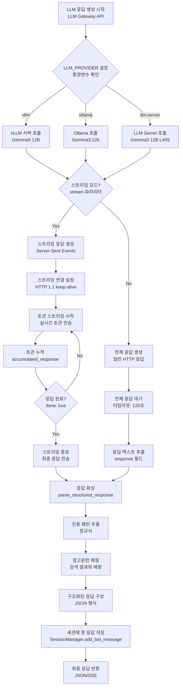

## 9. 병렬 처리 및 배치 처리 상세 플로우

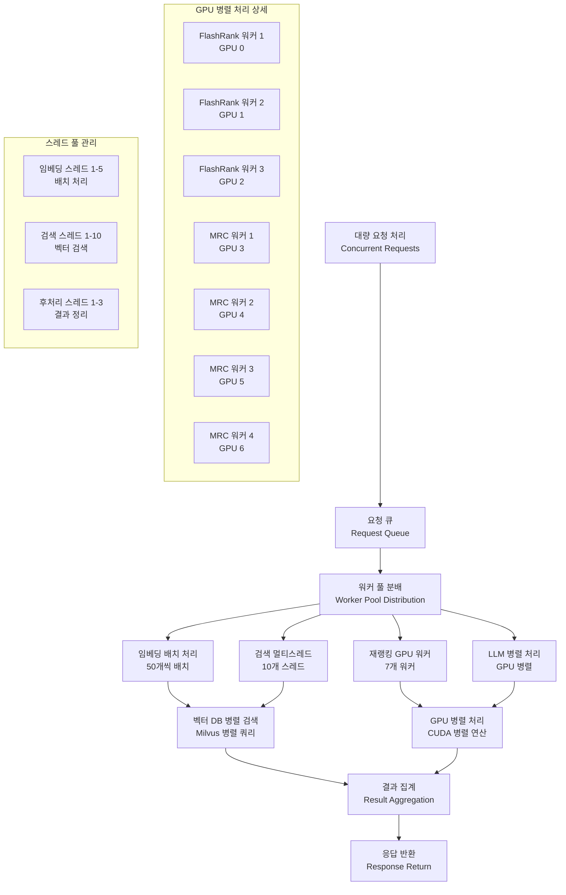

## 10. 에러 처리 및 복구 상세 플로우

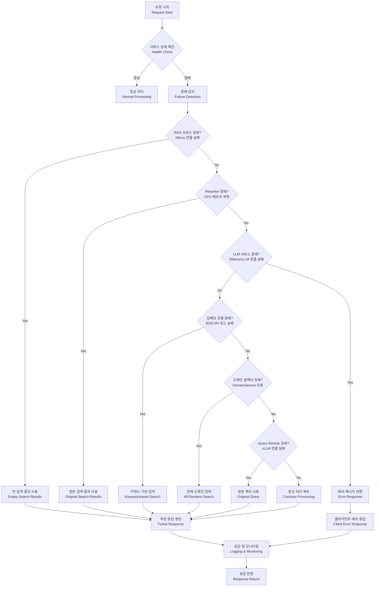

## 11. 성능 모니터링 상세 플로우

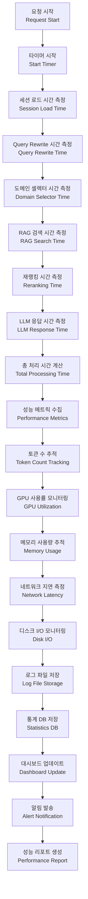

## 12. 전체 시스템 데이터 플로우 (완전)

```mermaid
graph LR
    A[사용자 입력<br/>User Input] --> B[Query Rewrite<br/>쿼리 재작성]
    B --> C[도메인 셀렉터<br/>Domain Selector]
    C --> D[RAG 검색<br/>RAG Search]
    D --> E[벡터 DB<br/>Vector Database]
    E --> F[임베딩 모델<br/>BGE-M3]
    F --> G[검색 결과<br/>Search Results]
    G --> H[하이브리드 재랭킹<br/>Hybrid Reranking]
    H --> I[FlashRank<br/>GTE-Multilingual]
    H --> J[MRC<br/>Machine Reading Comprehension]
    H --> K[원본 점수<br/>Original Score]
    I --> L[가중 평균<br/>Weighted Average]
    J --> L
    K --> L
    L --> M[필터링된 결과<br/>Filtered Results]
    M --> N[컨텍스트 구성<br/>Context Formation]
    N --> O[프롬프트 생성<br/>Prompt Generation]
    O --> P[LLM 응답<br/>LLM Response]
    P --> Q[구조화된 응답<br/>Structured Response]
    Q --> R[세션 저장<br/>Session Storage]
    R --> S[최종 응답<br/>Final Response]
    
    subgraph "중간 처리 단계"
        T[세션 관리<br/>Session Management]
        U[시멘틱 청킹<br/>Semantic Chunking]
        V[성능 모니터링<br/>Performance Monitoring]
        W[에러 처리<br/>Error Handling]
    end
```
