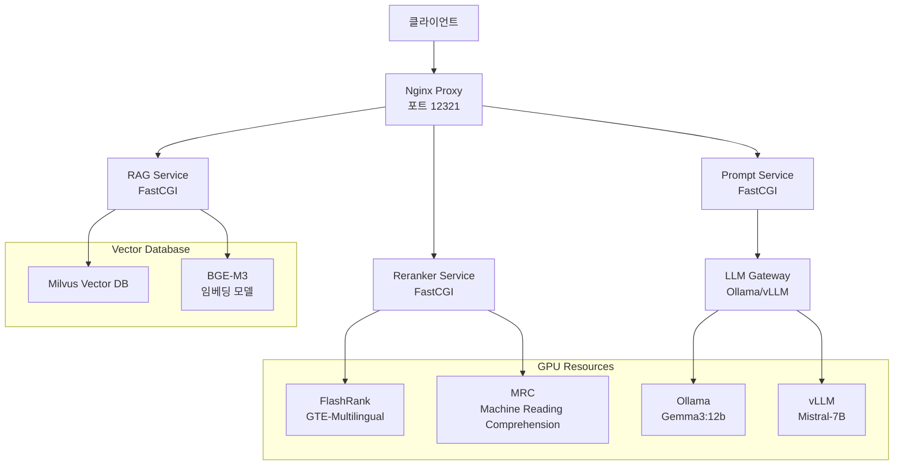
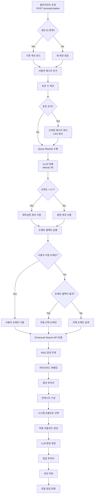
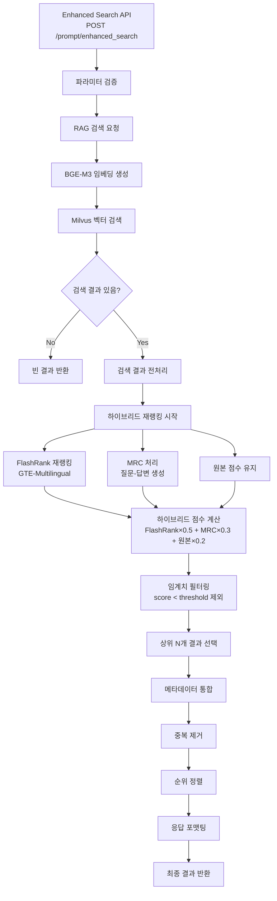
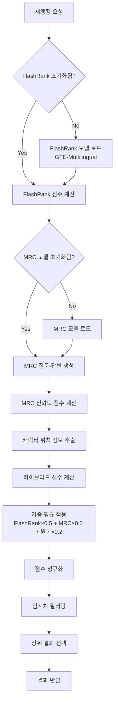
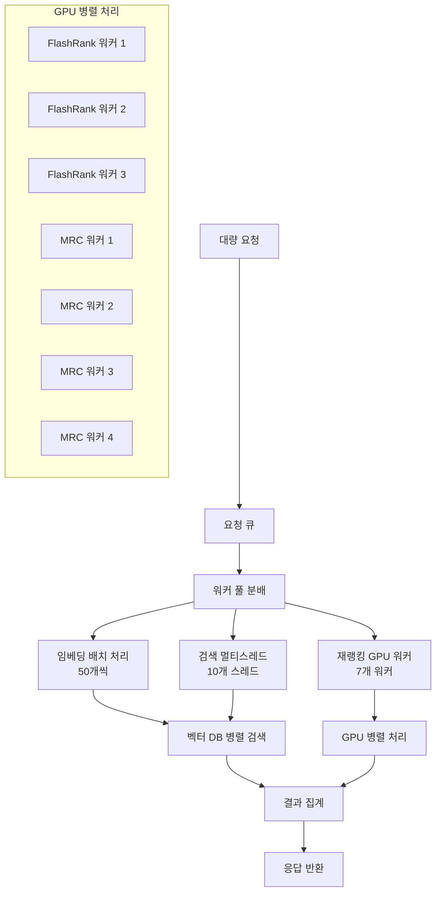
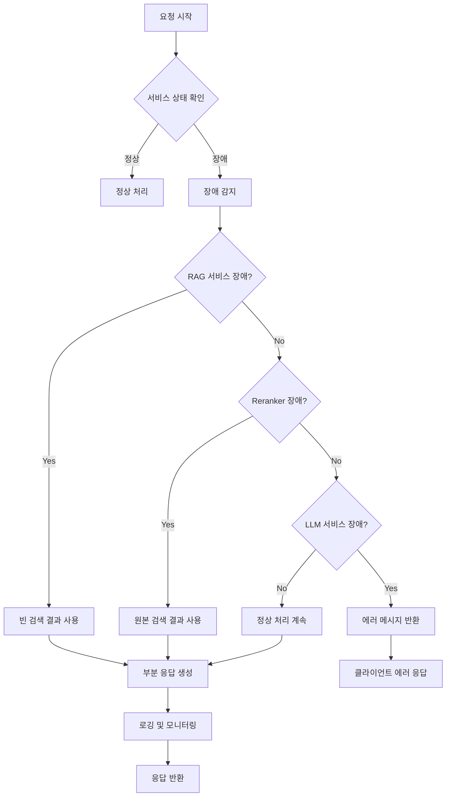
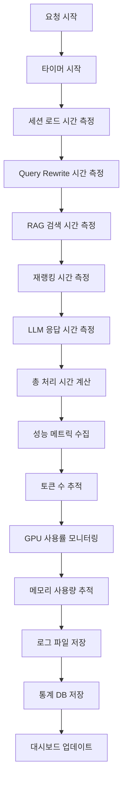
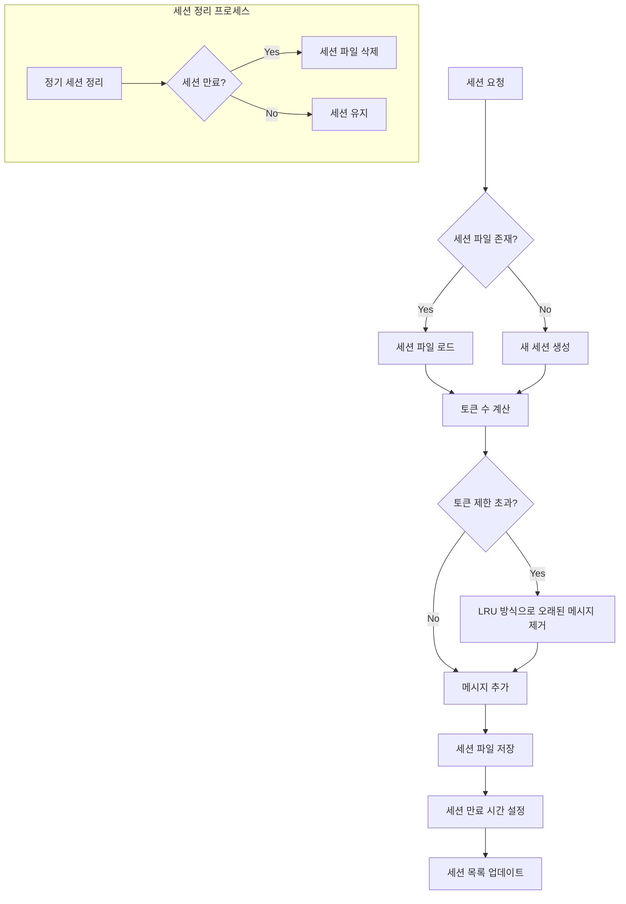
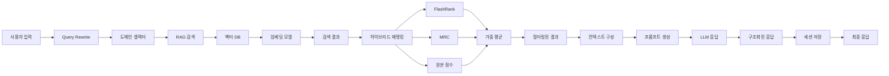

# Prompt Chatbot → Enhanced Search 워크플로우 (Mermaid 플로우차트)

## 1. 전체 시스템 아키텍처



## 2. 상세 워크플로우 (Prompt Chatbot)



## 3. Enhanced Search 상세 플로우



## 4. 하이브리드 재랭킹 상세 플로우



## 5. LLM 응답 생성 플로우

```mermaid
flowchart TD
    A[최종 프롬프트 생성] --> B{LLM_PROVIDER 설정}
    
    B -->|vllm| C[vLLM 서버 호출<br/>Gemma3 12B]
    B -->|ollama| D[Ollama 호출<br/>Gemma3:12b]
    
    C --> E{스트리밍 모드?}
    D --> E
    
    E -->|Yes| F[스트리밍 응답 생성<br/>실시간 토큰 전송]
    E -->|No| G[전체 응답 생성]
    
    F --> H[토큰 누적]
    H --> I{응답 완료?}
    I -->|No| F
    I -->|Yes| J[응답 파싱]
    
    G --> J
    
    J --> K[인용 패턴 추출<br/>📚[숫자]]
    K --> L[참고문헌 생성]
    L --> M[구조화된 응답 구성]
    M --> N[세션에 봇 응답 저장]
    N --> O[최종 응답 반환]
```

## 6. 병렬 처리 및 배치 처리



## 7. 에러 처리 및 복구 플로우



## 8. 성능 모니터링 플로우



## 9. 세션 관리 플로우



## 10. 전체 시스템 데이터 플로우


